<div align="center">

# Emergency Department Database and Analysis System

**Course:** DS 5110: Introduction to Data Management and Processing, Fall 2025

**Team 22:** Suk Jin Mun, Xiaobai Li, Shaobo (Ben) Chen

</div>

---

## Overview

This project analyzes Emergency Department triage classification and patient flow using a normalized relational database and statistical modeling. Core focus: database design, statistical analysis, data visualization, and Flask web application development.

---

## Frontend Dashboard

<p align="center">
  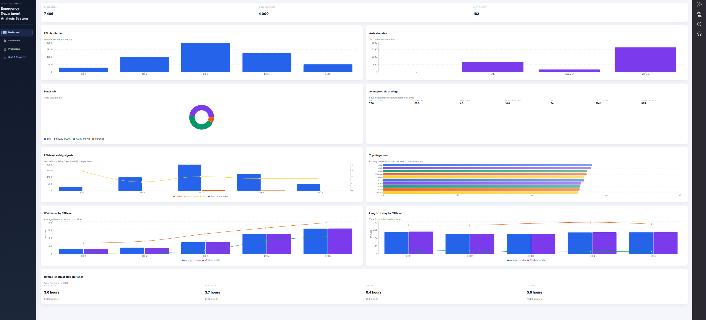
</p>

---

## Model Results

*Results below are from the classification-ready dataset (5,369 encounters after dropna preprocessing).*

### Data Pipeline

<p align="center">
  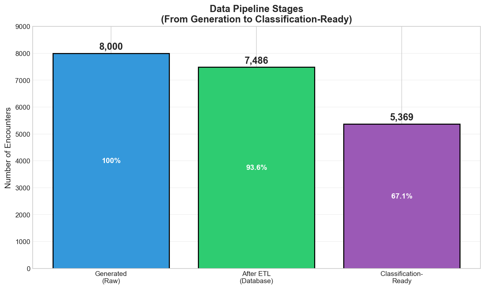
</p>

*Pipeline stages: 8,000 generated encounters → 7,486 after ETL cleaning → 5,369 classification-ready with complete features.*

---

### Classification Results

#### Model Performance Comparison

<p align="center">
  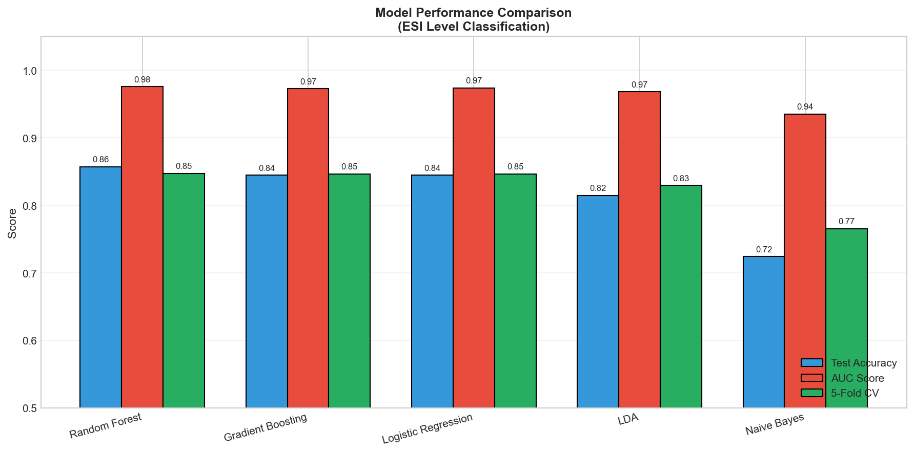
</p>

*Comprehensive comparison of all five classification models across test accuracy, AUC score, and 5-fold cross-validation accuracy.*

#### ESI Class Distribution

<p align="center">
  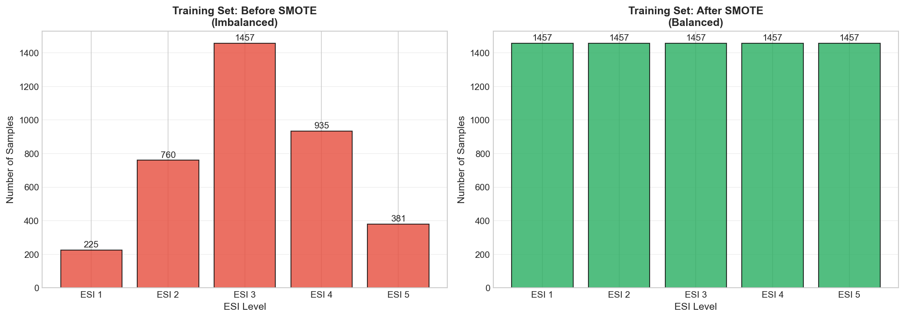
</p>

*Left: Original imbalanced distribution (ESI 3 at 38.8%). Right: Balanced distribution after SMOTE oversampling.*

#### Confusion Matrices

<p align="center">
  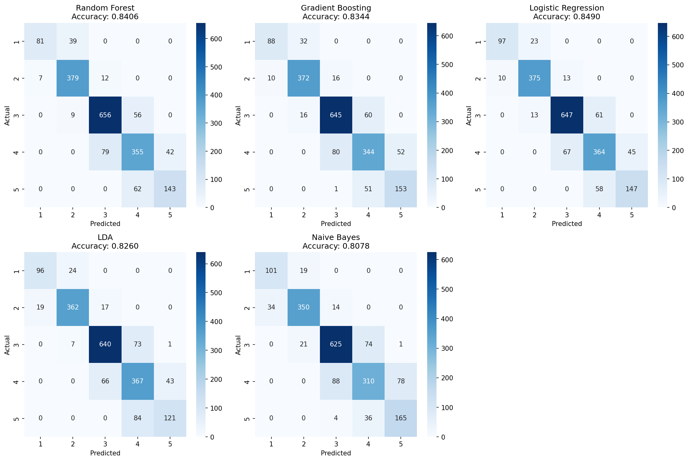
</p>

*Confusion matrices for all five classification models. Logistic Regression achieves 85.66% accuracy with strong diagonal dominance.*

#### ROC Curves

<p align="center">
  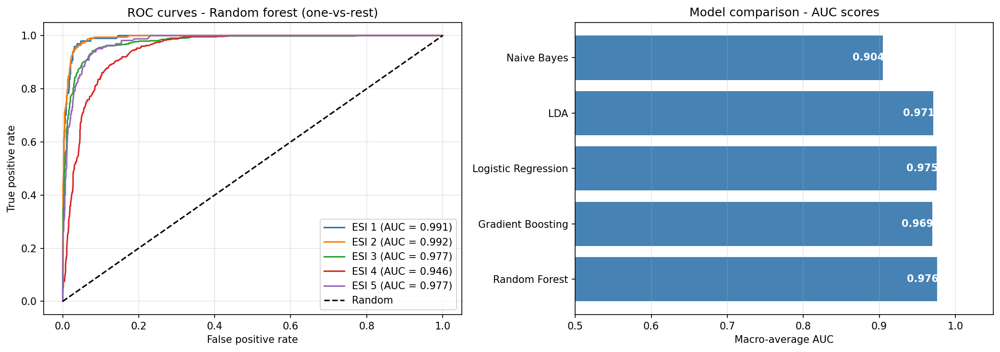
</p>

*Multi-class ROC curves (One-vs-Rest). All models achieve AUC > 0.90, with Logistic Regression and Random Forest achieving AUC > 0.97.*

#### Learning Curves (Bias-Variance Analysis)

<p align="center">
  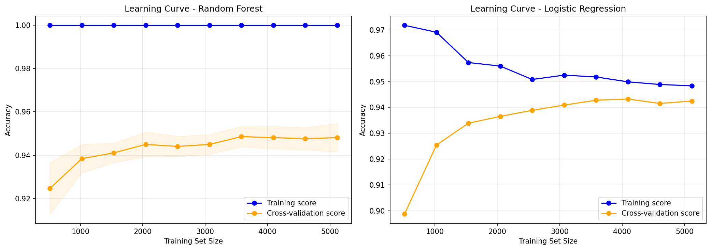
</p>

*Learning curves for bias-variance tradeoff analysis. Logistic Regression shows excellent generalization (minimal gap between training and validation).*

#### Feature Importance (Random Forest)

<p align="center">
  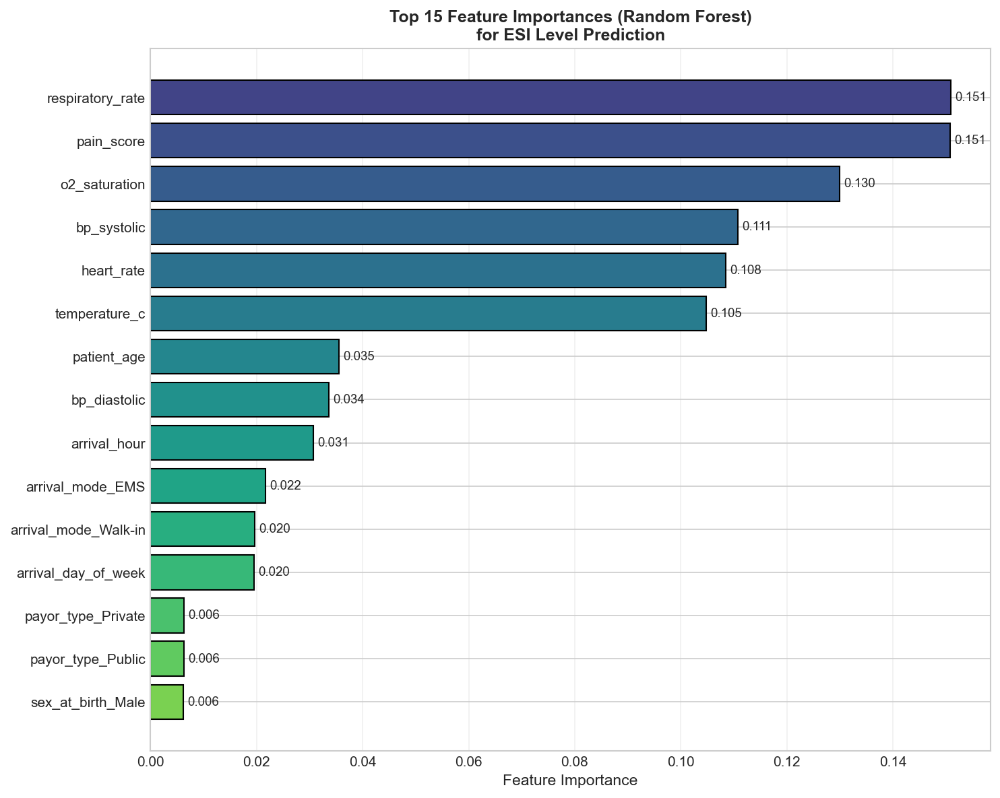
</p>

*Top 15 features by importance. Vital signs (SpO₂, heart rate, respiratory rate) dominate, aligning with ESI Handbook V5 guidelines.*

#### Logistic Regression Coefficients

<p align="center">
  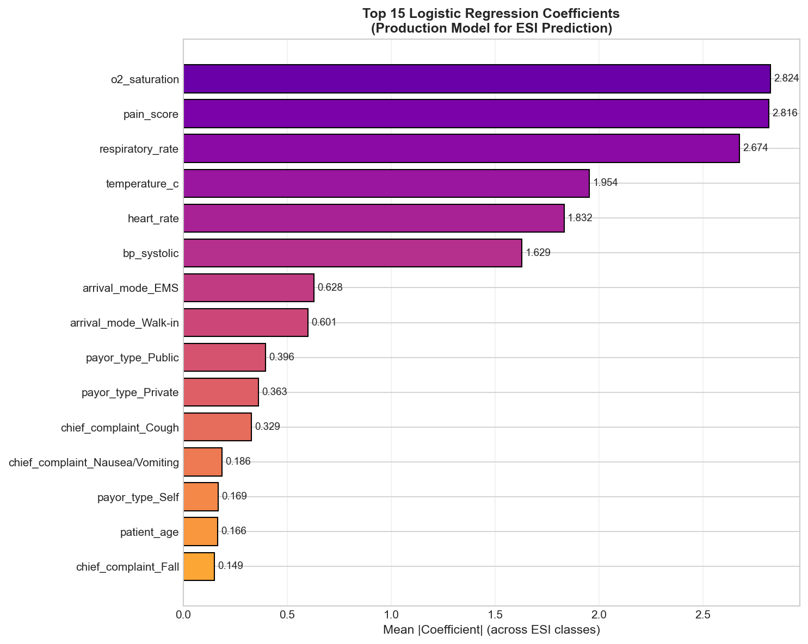
</p>

*Logistic regression coefficient analysis showing feature contributions to ESI level predictions.*

#### Precision-Recall Curves

<p align="center">
  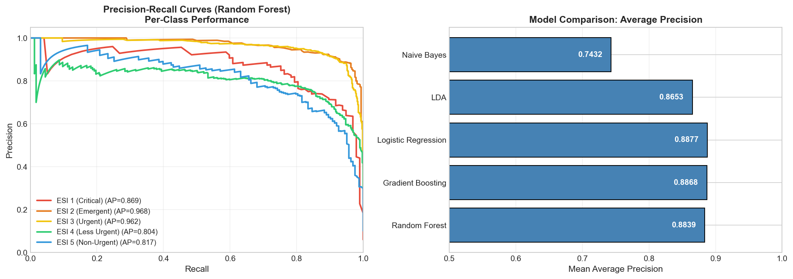
</p>

*Precision-recall curves for all ESI levels across different classification models.*

---

### Regression Results

#### Wait Time Prediction (Residual Analysis)

<p align="center">
  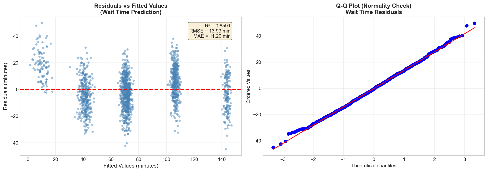
</p>

*Left: Residuals vs Fitted values showing homoscedasticity. Right: Q-Q plot confirming approximate normality of residuals. R² = 0.857, RMSE = 14.17 min.*

#### Wait Time Prediction Intervals

<p align="center">
  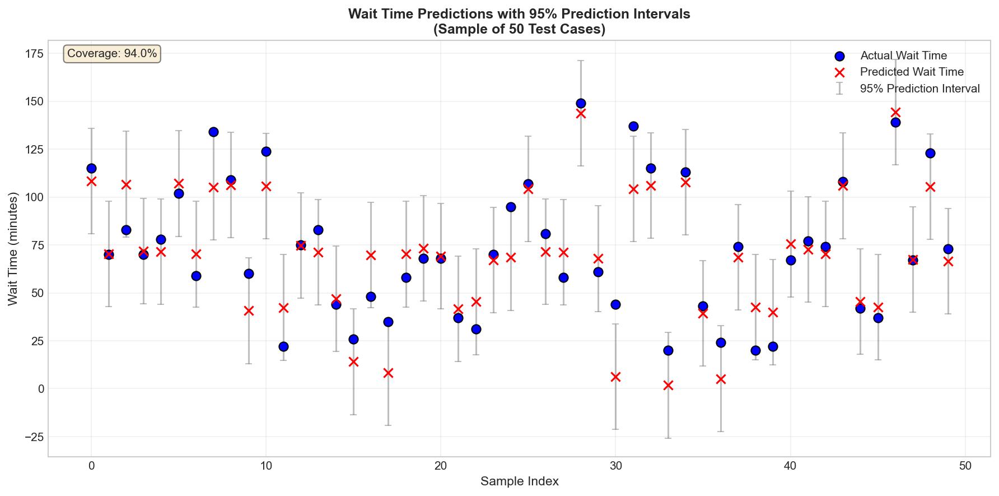
</p>

*Actual vs predicted wait times with 95% prediction intervals.*

#### Influence Diagnostics

<p align="center">
  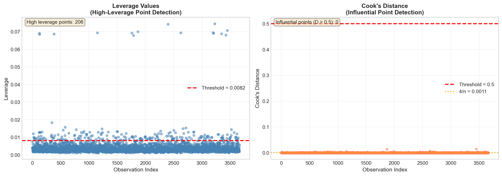
</p>

*Regression influence diagnostics: Cook's distance and leverage analysis for outlier detection.*

#### Volume Forecasting (Time Series)

<p align="center">
  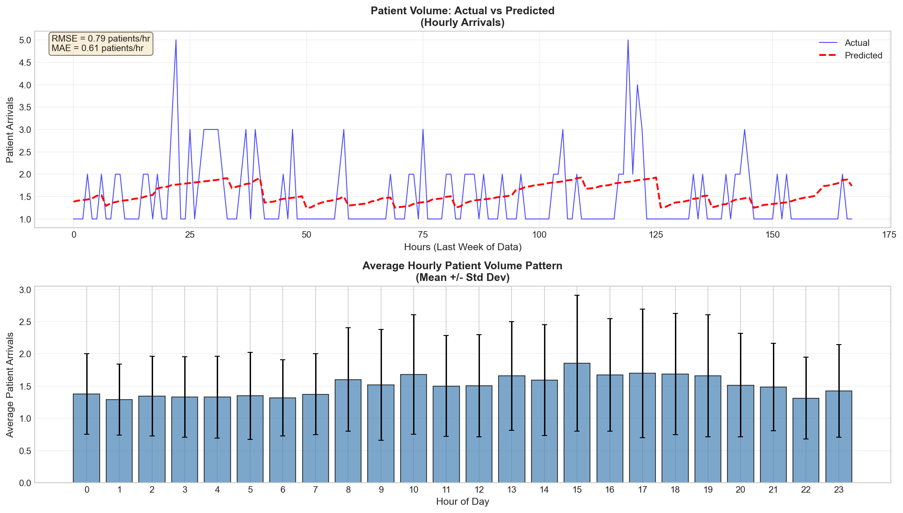
</p>

*Patient volume forecasting using Poisson GLM. RMSE = 0.86 patients/hour. Weekends show 29% higher volume.*

---

## Database Design

### Entity-Relationship Diagram

<p align="center">
  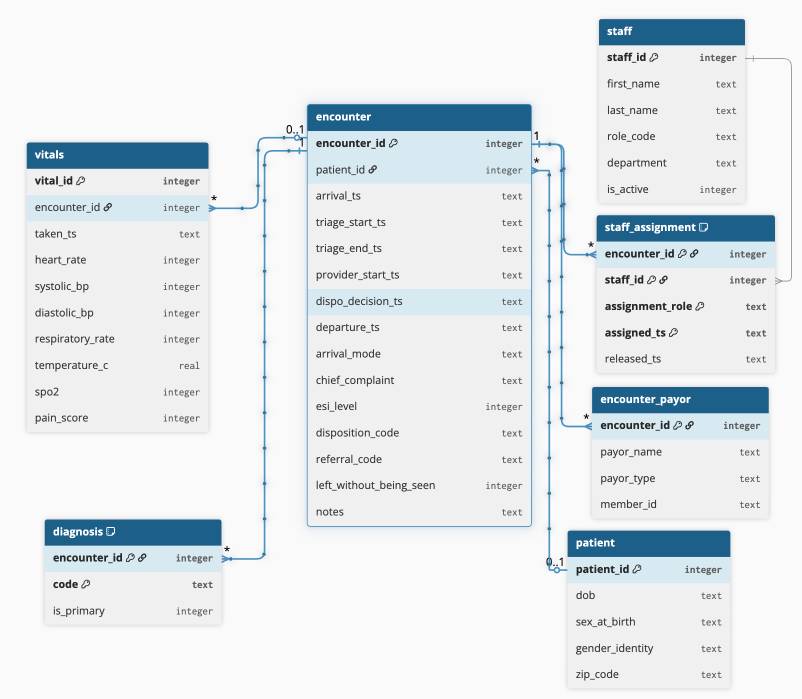
</p>

*Normalized 3NF database schema with 7 core entities: patient, encounter, vitals, diagnosis, staff, staff_assignment, and encounter_payor.*

---

## Statistical Models Summary

### Classification Models (ESI Prediction)

| Model | Accuracy | AUC | 5-Fold CV |
|-------|----------|-----|-----------|
| **Logistic Regression** | **85.66%** | 0.9756 | 85.66% ± 0.82% |
| Random Forest | 85.47% | 0.9764 | 85.47% ± 0.91% |
| Gradient Boosting | 84.30% | 0.9696 | 83.91% ± 0.76% |
| LDA | 83.80% | 0.9712 | 84.22% ± 0.88% |
| Naive Bayes | 60.58% | 0.9049 | 77.81% ± 0.94% |

*Logistic Regression selected for production due to best accuracy and excellent generalization (minimal train-validation gap).*

### Regression Models

| Model | Metric | Value |
|-------|--------|-------|
| Wait Time (Linear Regression) | R² | 0.8570 |
| Wait Time (Linear Regression) | RMSE | 14.17 min |
| Wait Time (Linear Regression) | MAE | 11.32 min |
| Volume (Poisson GLM) | RMSE | 0.86 patients/hour |
| Volume (Poisson GLM) | MAE | 0.67 patients/hour |

---

## Objectives

**Core (Required):**
1. Design normalized database (3NF) for patient visits, triage, treatments, wait times
2. Develop statistical models for patient urgency classification and wait time prediction
3. Create data visualizations for hospital administrators
4. Provide actionable recommendations for resource allocation
5. Build Flask web application with interactive dashboard

---

## Project Structure

```
DS5110-Final-Project/
├── backend/                    # Flask API server
│   ├── app.py                 # Main application entry point
│   ├── config/                # Database configuration
│   ├── models/                # ORM models and ML model classes
│   └── routes/                # API endpoint definitions
│       ├── api.py            # Data query endpoints
│       └── predictions.py    # ML prediction endpoints
├── frontend/                   # React + TypeScript web application
│   ├── src/
│   │   ├── pages/            # Dashboard, Encounters, Predictions, Staff
│   │   ├── lib/api.ts        # API client
│   │   └── types/            # TypeScript definitions
│   └── package.json
├── database/                   # SQL schema and setup scripts
│   ├── db_setup.sql          # Schema creation
│   └── db_import.sql         # Data import queries
├── dataset/                    # Generated ED data (CSV files)
│   ├── encounter.csv         # Patient encounters
│   ├── patient.csv           # Patient demographics
│   ├── vitals.csv            # Vital signs
│   ├── diagnosis.csv         # Diagnoses (ICD-10)
│   ├── staff.csv             # Staff information
│   └── generate_ed_csvs.py   # Data generation script
├── figs/                       # Model output figures
├── trained_models/             # Serialized ML models (.pkl)
├── notebooks/                  # Jupyter notebooks for analysis
├── scripts/                    # Training and testing scripts
└── docs/                       # Documentation
```

---

## Installation

### Prerequisites
- Python 3.9+
- Node.js 18+ (for frontend)

### Backend Setup

```bash
# Install Python dependencies
pip install flask flask-cors sqlalchemy pandas numpy scikit-learn statsmodels

# Run backend server (port 5001)
cd backend
python app.py
```

### Frontend Setup

```bash
# Install Node dependencies
cd frontend
npm install

# Run development server (port 5173)
npm run dev
```

### Database Setup

The database is auto-generated from CSV files on first run. CSV data files are in `dataset/`.

---

## API Endpoints

### Data Endpoints (`/api`)

| Endpoint | Method | Description |
|----------|--------|-------------|
| `/api/health` | GET | Health check |
| `/api/encounters` | GET | List encounters (with pagination) |
| `/api/encounters/<id>` | GET | Encounter details |
| `/api/patients/<id>` | GET | Patient info and history |
| `/api/staff` | GET | Staff list |
| `/api/statistics/overview` | GET | ED overview statistics |
| `/api/statistics/esi` | GET | ESI level statistics |
| `/api/statistics/vitals` | GET | Vital signs statistics |

### Prediction Endpoints (`/api/predictions`)

| Endpoint | Method | Description |
|----------|--------|-------------|
| `/api/predictions/models/info` | GET | Model information |
| `/api/predictions/esi` | POST | Predict ESI level |
| `/api/predictions/wait-time` | POST | Predict wait time |
| `/api/predictions/volume` | GET | Predict patient volume |

---

## Methodology

### Data Pipeline Stages

**Stage 1: Generated Data (Raw CSV)**
- 8,000 encounters generated with target ESI distribution

**Stage 2: Database (After ETL Cleaning)** — *Used by Frontend Dashboard*
- **7,486 encounters** (93.58% retention after ETL validation)
- ESI Distribution: Level 1: 6.0%, Level 2: 19.9%, **Level 3: 38.7%**, Level 4: 25.1%, Level 5: 10.3%

**Stage 3: Classification-Ready (After dropna)** — *Used by ML Models*
- **5,369 encounters** (71.72% retention from database)
- ESI Distribution: Level 1: 6.0%, Level 2: 20.2%, **Level 3: 38.8%**, Level 4: 24.9%, Level 5: 10.1%
- Train: 3,758 samples (70%) | Test: 1,611 samples (30%)

### Data Preprocessing
- **SMOTE**: Applied to handle class imbalance in ESI levels
- **StandardScaler**: Normalized all numerical features
- **One-hot encoding**: Converted categorical variables

### Feature Engineering
- 31 engineered features from demographics, vital signs, arrival characteristics, and temporal features
- Wait time calculation: arrival to provider start
- Temporal features: hour, day of week, weekend indicator

---

## Demo & Usage

### Running the Application

1. **Start Backend API** (Terminal 1):
   ```bash
   cd backend
   python app.py
   # API running at http://localhost:5001
   ```

2. **Start Frontend** (Terminal 2):
   ```bash
   cd frontend
   npm run dev
   # UI running at http://localhost:5173
   ```

3. **Open Browser**: Navigate to `http://localhost:5173`

### Training Models (Optional)

```bash
cd scripts
python train_models.py
```

---

## Team Roles

**Suk Jin Mun - Backend API Developer:**
- Flask API endpoints and database integration
- Statistical model training (classification, regression)
- Business logic and validation
- GitHub repository management

**Xiaobai Li - Frontend Developer:**
- React + TypeScript web application
- Data visualizations (Matplotlib, Seaborn, Plotly)
- Model evaluation notebook
- Presentation materials

**Shaobo Chen - Database Architect:**
- Database schema design (3NF normalization)
- Simulated ED data generation
- ETL pipeline development
- SQL analytical queries

---

## References

1. Suamchaiyaphum K, Jones AR, Polancich S. The accuracy of triage classification using Emergency Severity Index. *International Emergency Nursing*. 2024;77:101537.
2. Ivanov O, Wolf L, Brecher D, et al. Improving ED Emergency Severity Index Acuity Assignment Using Machine Learning and Clinical Natural Language Processing. *Journal of Emergency Nursing*. 2021;47(2):265-278.e7.

---

## License

This project is for educational purposes as part of DS 5110 coursework at Northeastern University.
